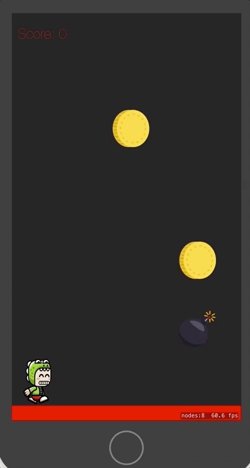

# Coin-Man
IOS game in which the player should collect coins and avoid collision with bombs by tap gesture.

Table of contents:
=================

<!--ts-->
   * [Technologies used and cocoapods.](#technologies-used-and-cocoapods)
   * [Prerequisites](#prerequisites)
   * [Clone](#clone)
   * [Recording Game](#recording-game)
   * [License](#license)
<!--te-->

Technologies used and Cocoapods:
===========

  - Swift 4.0 and Xcode 9.0 are used to implement this project.
  - SpriteKit
  
Prerequisites:
=============

  - You Should have MacOS (operation system supported by apple.
  - Xcode IDE.

Clone:
=====
  Clone this repo `https://github.com/shazly333/Coin-Man.git`
  
Recording Game:
===============

License:
========		 
 

Copyright (c) 2018 Mohamed Kamal El-Shazly
